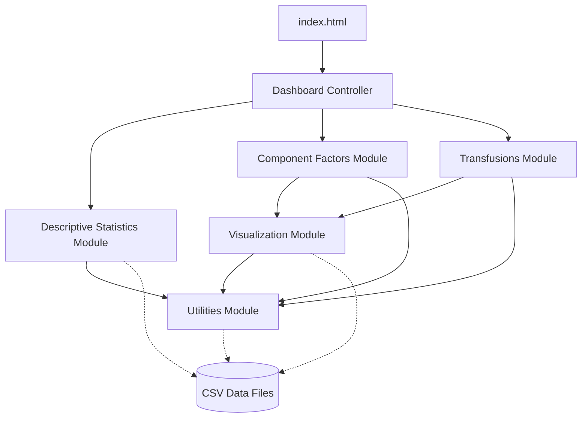
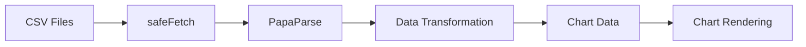
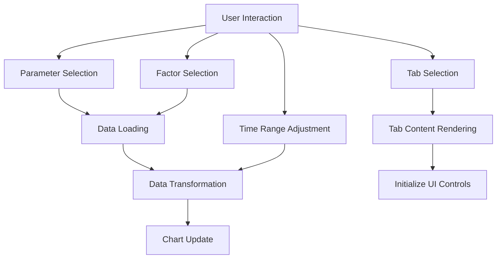

# System Patterns: Transfusion Dashboard

## Architectural Overview

The Transfusion Dashboard follows a modular frontend architecture with clear separation of concerns between different functional components. The system is designed as a client-side web application that processes and visualizes CSV data files.

## Module Relationships

### Core Module Structure

The application is organized into distinct functional modules:

1. **Dashboard Controller (`dashboard.js`)**
   - Central orchestration component
   - Manages application state
   - Coordinates between modules
   - Handles tab switching logic

2. **Descriptive Statistics Module (`descriptiveStats.js`)**
   - Self-contained module for statistical visualization
   - Directly interfaces with CSV data
   - Generates dynamic HTML tables

3. **Component Factors Module (`componentFactors.js`)**
   - Manages RBC component factors visualization
   - Delegates chart rendering to Visualization Module
   - Handles factor-specific UI and controls

4. **Transfusions Module (`transfusions.js`)**
   - Manages RBC transfusions visualization
   - Creates multi-parameter interface
   - Handles time range controls
   - Manages paired plot display

5. **Visualization Module (`visualization.js`)**
   - Core rendering engine
   - Provides shared visualization functionality
   - Prepares and transforms data for charts
   - Handles chart creation via Chart.js

6. **Utilities Module (`utils.js`)**
   - Shared helper functions
   - CSV loading and parsing functions
   - Error handling and formatting utilities
   - Debug functionality

## Key Design Patterns

### Module Pattern

Each functional area is encapsulated in its own module with clear interfaces and responsibilities. This promotes:
- Code organization and maintainability
- Separation of concerns
- Easier testing and debugging
- Potential for parallel development

### Facade Pattern

The Dashboard Controller acts as a facade, providing a simplified interface to the complex subsystems. It:
- Presents a unified interface to initialize the application
- Abstracts the complexity of module coordination
- Manages tab switching without modules needing to know about each other

### Strategy Pattern

Chart rendering implementations apply the strategy pattern:
- Common interface for different visualization types
- Interchangeable strategies for various chart types
- Runtime selection of appropriate rendering approaches

### Observer Pattern

UI interaction and data changes implement an informal observer pattern:
- UI elements subscribe to user interactions
- Visualization updates based on selection changes
- Chart updates in response to data changes

## Data Flow Patterns

### CSV Data Loading Pipeline

1. Data is fetched from CSV files using the `safeFetch()` utility
2. Data is parsed using PapaParse library
3. Data undergoes specific transformations based on visualization needs
4. Transformed data is prepared for Chart.js
5. Charts are rendered with appropriate configuration

### User Interaction Flow

1. User interacts with UI elements
2. Appropriate event handlers process the interaction
3. Required data is loaded or filtered
4. Data is transformed for visualization
5. Charts are updated to reflect changes

## Extension Points

The system architecture provides several well-defined extension points:

### Adding New Visualizations

To add new visualization types:
1. Create new visualization functions in visualization.js
2. Add UI controls in the appropriate module
3. Connect data loading and transformation logic
4. Register with the dashboard controller

### Supporting New Data Types

To support new CSV formats:
1. Add new data loading functions in the appropriate module
2. Create data transformation logic for the new format
3. Update UI to expose the new data capabilities

### Adding New Tabs

To add entirely new analytical perspectives:
1. Create a new module following the established pattern
2. Implement the required UI and visualization logic
3. Register the tab with the dashboard controller

### Enhancing Chart Capabilities

To extend chart functionality:
1. Add new chart configuration options to the appropriate rendering functions
2. Expose new controls in the UI
3. Connect the UI controls to the chart configuration

## Scalability Considerations

The architecture supports growth in several dimensions:

1. **Data Volume**: CSV parsing and data transformation are designed to handle increasing data volumes

2. **Feature Complexity**: The modular approach allows new features to be added without affecting existing functionality

3. **Visualization Types**: The system can accommodate new chart types through the abstracted visualization module

4. **User Interface Components**: The component-based UI can be extended with new controls and interactions

## Technical Implementation Details

### Module Communication

Modules communicate through well-defined interfaces:
- Initialization functions that set up module functionality
- Event handlers for user interactions
- Data transformation functions
- Rendering callbacks

### Error Handling

The system implements a robust error handling approach:
- `safeFetch()` utility for resilient data loading
- Graceful degradation when data is unavailable
- User-friendly error messages
- Detailed console logging in debug mode

### Loading and Initialization Sequence

The application follows a defined loading sequence:
1. Dashboard controller initializes
2. Basic UI structure is created
3. Descriptive statistics are loaded
4. Default visualizations are prepared
5. User interactions are enabled
