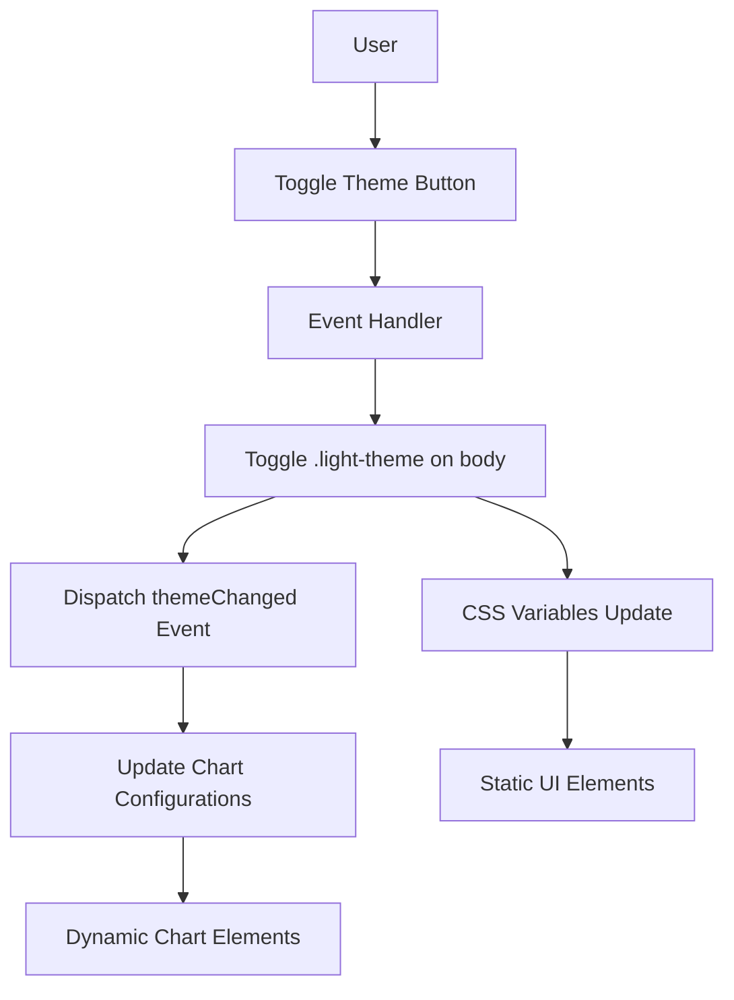

# Theme Implementation Guide: Transfusion Dashboard

This guide provides comprehensive documentation for implementing and maintaining the theme system in the Transfusion Dashboard.

## Theme Architecture Overview

The dashboard uses a dual-theme system (dark/light) implemented through:
- CSS variables for static styling
- JavaScript conditional rendering for dynamic content
- Theme toggling via body class modification
- Event-driven updates for chart redrawing



## Theme Implementation Guidelines

### 1. CSS Variable Usage

#### Base Implementation
```css
/* Default (dark) theme in :root */
:root {
  --bg-main: #0a0a0a;
  --text-primary: #ffffff;
  /* other dark theme variables */
}

/* Light theme overrides */
.light-theme {
  --bg-main: #f8f9fa;
  --text-primary: #111827;
  /* other light theme overrides */
}
```

#### Best Practices
- Always use CSS variables for themeable elements
- Never hardcode colors that should change between themes
- Group related variables logically in the CSS file
- Use semantic variable names that describe purpose, not appearance

### 2. JavaScript Theme Detection

#### Standard Pattern
```javascript
// Detect current theme
const isLightTheme = document.body.classList.contains('light-theme');

// Apply conditional styling
const backgroundColor = isLightTheme ? 'rgba(255, 255, 255, 0.95)' : 'rgba(30, 30, 30, 0.95)';
const textColor = isLightTheme ? 'rgba(0, 0, 0, 0.9)' : 'rgba(255, 255, 255, 1.0)';
```

#### Best Practices
- Use consistent theme detection across all JavaScript modules
- Apply the same conditional logic pattern throughout the codebase
- For Chart.js configurations, follow the established pattern for each option

### 3. Tooltip Implementation

Tooltips follow a special pattern where they use consistent dark backgrounds with light text in both themes:

```javascript
tooltip: {
  backgroundColor: document.body.classList.contains('light-theme') ? 
                  'rgba(45, 55, 72, 0.95)' : 'rgba(30, 30, 30, 0.95)',
  titleFont: {
    family: "'Inter', sans-serif",
    size: 13,
    weight: 600
  },
  bodyFont: {
    family: "'Inter', sans-serif",
    size: 12
  },
  borderColor: document.body.classList.contains('light-theme') ? 
              'rgba(0, 0, 0, 0.2)' : 'rgba(255, 255, 255, 0.2)',
  borderWidth: 1,
  padding: 10,
  titleColor: 'rgba(255, 255, 255, 1.0)', // Always white text
  bodyColor: 'rgba(255, 255, 255, 0.9)', // Always white text with slight opacity
  boxShadow: '0 4px 6px rgba(0, 0, 0, 0.1), 0 2px 4px rgba(0, 0, 0, 0.06)'
}
```

### 4. Chart Element Theme Adjustments

#### Line Thickness
```javascript
borderWidth: document.body.classList.contains('light-theme') ? 2 : 3, // Thicker in dark mode
```

#### Grid Lines
```javascript
grid: {
  color: document.body.classList.contains('light-theme') ? 
        'rgba(0, 0, 0, 0.05)' : 'rgba(255, 255, 255, 0.15)' // Higher opacity in dark mode
}
```

#### Text Elements
```javascript
ticks: {
  font: {
    size: 11,
    weight: document.body.classList.contains('light-theme') ? 400 : 500 // Bolder in dark mode
  },
  color: document.body.classList.contains('light-theme') ? 
         'rgba(0, 0, 0, 0.7)' : 'rgba(255, 255, 255, 0.9)' // Higher contrast in dark mode
}
```

#### Fill Areas
```javascript
area: isDarkMode ? 'rgba(133, 125, 255, 0.25)' : 'rgba(99, 91, 255, 0.15)', // Higher opacity in dark mode
```

## Theme Toggle Testing Protocol

When implementing new features or modifying existing ones, follow this testing protocol:

### Required Testing Steps

1. **Initial Development**
   - Begin development in the default dark theme
   - Implement the feature with theme awareness from the start

2. **Light Mode Testing**
   - Test the feature in light mode before considering it complete
   - Verify all text has sufficient contrast
   - Check that all interactive elements are clearly visible
   - Ensure charts and visualizations are properly rendered

3. **Toggle Testing**
   - Toggle between dark and light modes multiple times to verify transitions
   - Check for any visual glitches during transition
   - Verify that all dynamic content updates correctly

4. **Edge Case Checking**
   - Test with different data sets if applicable
   - Verify at different screen sizes
   - Check text overflow and truncation in both themes

### Common Theme Issues to Watch For

1. **Illegible Text**
   - Light text on light backgrounds
   - Dark text on dark backgrounds
   - Insufficient contrast ratios

2. **Invisible or Hard-to-See Elements**
   - Buttons or controls that blend into backgrounds
   - Chart elements with insufficient contrast
   - Icons without proper theme adaptation

3. **Inconsistent Styling**
   - Some elements updating with theme changes while others don't
   - Inconsistent text colors within the same component
   - Varying contrast levels across similar elements

4. **Transition Issues**
   - Elements flickering during theme toggle
   - Temporary misalignment during transition
   - Delayed updates of some components

## Code Duplication Awareness

A key architectural consideration is that Chart.js configurations with theme-aware code are currently duplicated across multiple files:

### Current Duplication Points

1. **visualization.js**
   - Contains Chart.js config including theme-aware tooltips
   - Used by Component Factors tab

2. **transfusions.js**
   - Contains similar Chart.js config with theme-aware tooltips 
   - Used by RBC Transfusion Effects tab
   - Contains separate configurations for standard and LOESS charts

### When Making Theme-Related Changes

When modifying theme-related styling:

1. Identify all locations where the component appears
2. Update all instances consistently
3. Test each tab and feature that uses the component
4. Consider refactoring to reduce duplication if appropriate

### Future Improvement Opportunities

Consider these refactoring opportunities to reduce theme-related duplication:

1. Extract common Chart.js configurations into shared utility functions
2. Implement a theme service that centralizes theme detection and styling
3. Create reusable chart configuration factories with theme awareness built in

## Theme Change Event Handling

The dashboard dispatches a custom `themeChanged` event when the theme is toggled. Components can listen for this event to update their appearance:

```javascript
// Listen for theme changes
document.addEventListener('themeChanged', () => {
  // Update charts or UI elements when theme changes
  updateAllCharts();
});
```

This event-driven approach ensures that all components can react to theme changes without tight coupling to the theme toggle mechanism.
